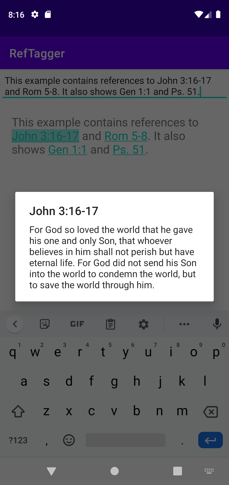

# RefTagger
RefTagger is an Android library that transforms Bible references into clickable links, targeting the free BibleGateway API.



## Transform References

```kotlin
val refTagger = RefTagger.Builder().build()

val text = "The reference John 3:16-17 will become a link."
val taggedText = refTagger.tag(text)

aTextView.text = taggedText
```

**Note:** For a TextView to respond to clickable links, you must provide a movement method that can handle this, such as Android's `LinkMovementMethod`.

```kotlin
aTextView.movementMethod = LinkMovementMethod.getInstance()
```

## Customizations
RefTagger requests the NIV version by default, but this can be changed in the builder.

```kotlin
val refTagger = RefTagger.Builder()
                  .setDefaultVersion("ESV")
                  .build()
```

RefTagger also allows customizing the text color and style (bold, italics, underline) of links.

```kotlin
val refTagger = RefTagger.Builder()
                  .setLinkColor(Color.BLACK)
                  .underlineLinks(false)
                  .italicizeLinks(true)
                  .boldLinks(true)
                  .build()
```

**Note:** `TextView` shows a background highlight on link clicks by default. To remove this, set
```kotlin
aTextView.highlightColor = Color.TRANSPARENT
```

## Responding to clicks
RefTagger can respond to a link click in 4 basic ways:

 1. Show an alert dialog with the reference and biblical text (default)
 ```kotlin
val refTagger = RefTagger.Builder()
                  .useDialog()
                  .build()
```
Since a dialog is the default option, you can also just build the RefTagger without specifying any click handler.
 ```kotlin
val refTagger = RefTagger.Builder().build()
```
 2. Launch Bible Gateway in an external browser.
```kotlin
val refTagger = RefTagger.Builder()
                  .useExternalBrowser()
                  .build()
```
 3. Ignore clicks.
  ```kotlin
val refTagger = RefTagger.Builder()
                  .ignoreClicks()
                  .build()
```
 4. Custom click handler (more below)

```kotlin
val refTagger = RefTagger.Builder()
                  .setClickHandler(...)
                  .build()
```

**Note:** only one click handling mechanism is allowed. If multiple mechanisms are provided, RefTagger will use the last one provided and ignore the others.

So in the code below, RefTagger will ignore clicks and *will not* launch an external browser or a dialog.

```kotlin
val refTagger = RefTagger.Builder()
                  .useExternalBrowser()
                  .useDialog()
                  .ignoreClicks()
                  .build()
```

## Custom Click Handlers
RefTagger accepts a few different custom click handlers to provide more control over the way that the text is displayed.

 1. BibleGatewayURL
 
This handler returns the Bible Gateway URL for the reference the user clicked on. This could be useful as an alternative to `Builder.useExternalBrowser()` if you want to display Bible Gateway in a custom WebView within your app, rather than launching an external browser.
 ```kotlin
val refTagger = RefTagger.Builder()
                  .setClickHandler(object : ClickHandler.BibleGatewayURL() {
                    override fun onClick(url: String) {
                      // do something with the URL
                    }
                  })
                  .build()
```
 2. ScriptureReference
 
This handler returns the exact Scripture reference that the user clicked on (e.g., "John 3:16-17"). This could be useful if you want to target an API other than Bible Gateway, or if you are using RefTagger within an app that already has a biblical text stored locally.
 ```kotlin
val refTagger = RefTagger.Builder()
                  .setClickHandler(object : ClickHandler.ScriptureReference() {
                    override fun onClick(reference: String) {
                      // do something with the scripture reference
                    }
                  })
                  .build()
```
 3. ScriptureText
 
 This handler returns the actual biblical text (e.g., "For God so loved the world...") for the Scripture reference that the user clicked on (e.g., "John 3:16-17").
 
 Like `Builder.useDialog()` this approach places the burden of the network request (and threading, stream reading, error handling) on RefTagger so you don't have to worry about it. However, this approach also provides more flexibility in UI/UX since the UI/UX implementation is left up to you. This could be useful if you want to display the biblical text within a BottomSheetDialog or some other view within your app's UI.
 
 ```kotlin
val refTagger = RefTagger.Builder()
                  .setClickHandler(object : ClickHandler.ScriptureText() {
                    override fun onSuccess(ref: String, text: String) {
                      // do something with the text and reference
                    }

                    override fun onError(message: String) {
                      // handle the error
                    }
                   })
                  .build()
```
